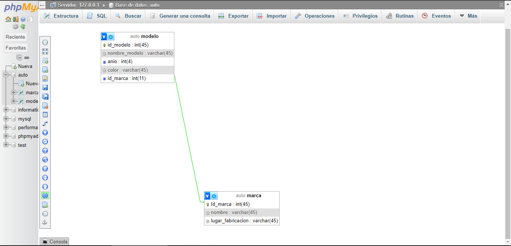

Primera Entrega TPE 1 WEB 2
Integrantes: Santiago Tomas Franco, Tomas Prado

En esta entrega, proponemos el diseño de una base de datos llamada "auto" que contendrá dos tablas, en una de ellas varias marcas de autos llamada "marca", cada una con un identificador único.
Estas marcas estarán vinculadas a una segunda tabla "modelo" que incluirá los distintos modelos de autos correspondientes a cada marca, junto con sus características específicas. Cada modelo de auto estará asociado a una marca a través de su id, permitiendo así que una marca tenga múltiples modelos registrados en la base de datos con el mismo id.

